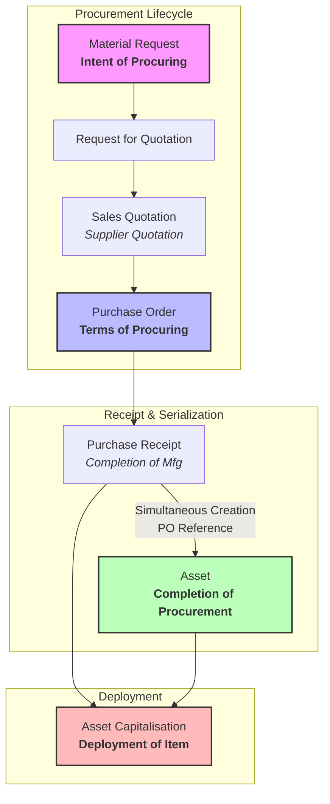

# Swift Fix

A premium Computerized Maintenance Management System (CMMS) custom Frappe application designed for **Sravi Enterprises**.

---

## 1. Overview of the Application

Swift Fix automates the lifecycle of capital equipment and fixed assets through a custom business flow called **Procurement-based Asset Deployment**. This workflow spans initial procurement intent, vendor quotes and Recce processing, contract terms commitments, receipt serialization, asset generation, and final field deployment (capitalization).

### The Procurement-based Asset Deployment Lifecycle



---

## 2. Core Features & Business Logic

### 1. Material Request (MR)
- **Fixed Asset Enforcement**: Validates that only items marked as `is_fixed_asset = 1` are permitted in Material Requests.
- **Button Hiding Rules**: Standard "Purchase Order" and "Supplier Quotation" buttons are hidden on the MR form to prevent direct creation bypassing the RFQ stage.
- **Status Banner**: Displays the custom processing status (`Draft`, `Shortlisted`, `Under Process`, `Item Received`, `Asset Capitalised`, `Cancelled`, `Held`) dynamically in the UI without modifying the document state.

### 2. Request for Quotation (RFQ)
- **Pre-requisite Validation**: An RFQ can only be created and submitted if the linked Material Request's status is **Shortlisted**.
- **Timeline Commenting**: Automatically logs a comment on the linked MR timeline: *"A Quotation is requested from Vendor and Recce Process is in Progress"*.

### 3. Purchase Order (PO)
- **Under Process Transition**: Submission of the PO automatically transitions the linked Material Request status to **Under Process** (unless Purchase Receipts or Assets already exist for it).
- **Status Locks**: Active POs prevent the linked Material Request from being cancelled or placed on hold.

### 4. Purchase Receipt (PR) & Asset Generation
- **Automatic Serialization**: Submission of a Purchase Receipt automatically generates a unique serial number (`[Item Code]-[Hash]`) for the item and updates the row.
- **Simultaneous Asset Creation**: Automatically generates and saves the corresponding **Asset** linked to the same Purchase Order.
- **Completion Hook**: Completes the Purchase Order status and transitions the linked Material Request status to **Item Received**.

### 5. Asset QR Code Generation
- Automatically generates a QR code URL (`/app/asset-maintenance-log/new-asset-maintenance-log?asset=[Asset_Name]`) and attaches the PNG image to the Asset document upon creation (`after_insert`).

### 6. Asset Capitalization & Purchase Invoice Validation
- **Purchase Invoice Constraint**: Submission of a Purchase Invoice is blocked if the corresponding Purchase Receipt items haven't been capitalized through an `Asset Capitalization` document first.
- **Capitalization Hook**: Submission of an `Asset Capitalization` document transitions the linked Material Request status to **Asset Capitalised**.

---

## 3. Installation

Install Swift Fix using the [bench](https://github.com/frappe/bench) CLI:

```bash
cd /path/to/your/frappe-bench
bench get-app https://github.com/vinodkumarkolli/swift_fix.git --branch develop
bench --site [your-site-name] install-app swift_fix
```

---

## 4. Developer Utilities & Test Execution

### Running Automated Integration Tests

Swift Fix includes a comprehensive test suite covering the entire procurement flow, security and permissions checks, status transitions, and data validations.

To run the tests:

```bash
bench --site [your-site-name] run-tests --module swift_fix.tests.test_procurement_flow
```

### Database Migration & Clearing Cache

When pulls or modifications are made to hook structures, custom fields, client scripts, or role configurations, apply them by running:

```bash
bench --site [your-site-name] migrate
bench --site [your-site-name] clear-cache
```

### Exporting App Fixtures

If custom fields, role permissions, or client scripts are updated in the desk, export them to git-trackable fixtures using:

```bash
bench --site [your-site-name] export-fixtures
```

---

## 5. Contributing

This app uses `pre-commit` for code formatting and linting. Please [install pre-commit](https://pre-commit.com/#installation) and enable it for this repository:

```bash
cd apps/swift_fix
pre-commit install
```

Code quality and formatting checks are governed by:
- **Ruff** (Python formatting and linting)
- **ESLint & Prettier** (JS structure and styling)
- **Pyupgrade** (Python syntax upgrades)

---

## 6. License

This project is licensed under the [MIT License](license.txt).
